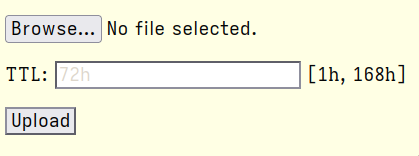

# imgserve

[](https://builds.sr.ht/~kovmir/imgserve?)

Minimalist image hosting server.

* No dependencies
* No database
* No JS required
* Image [TTL](https://en.wikipedia.org/wiki/Time_to_live)
* Image deduplication

# PREVIEW



*Stylish web UI following modern design guidelines.*

# INSTALL

Install [Go](https://go.dev/), then:

```bash
git clone https://git.sr.ht/~kovmir/imgserve
cd imgserve
make
sudo make install
```

# USAGE

```bash
imgserve -h # To see all CLI options.
imgserve # Simply run the executable to start the server.
```

Upload images via web UI at `http://localhost:8077/` or `curl`:

```bash
curl -X POST -F "image=@/path/to/image.jpg" http://localhost:8077/upload
curl -X POST -F "image=@/path/to/image.jpg" -F "ttl=24h" http://localhost:8077/upload
```

TTL format is documented [here](https://pkg.go.dev/time#ParseDuration).
